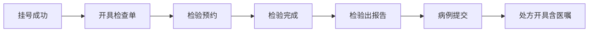

# 多病种通用就诊流程接口文档指引

## 1. 文档目的与适用范围

本文档用于指导医院信息系统与健康教育智能体平台进行标准化接口对接，支持多病种场景（如消化道、内分泌、心血管、呼吸等）的统一接入与扩展。

适用业务范围：
- 门诊与住院就诊流程
- 检查/检验相关申请、预约、执行、报告
- 病历提交与处方开具（含长期/临时医嘱）
- 患者教育与随访消息触发

## 2. 对接架构与职责边界

核心系统角色：
- HIS：挂号、就诊主索引、诊疗行为主数据来源
- EMR：病历内容与诊断信息来源
- LIS：检验申请、预约、执行、报告来源
- RIS/PACS：检查申请、预约、执行、报告来源（影像/内镜等）
- 药学系统/处方系统：处方与审方信息来源
- 智能体平台：流程编排、消息触发、教育内容分发、患者跟踪

推荐对接模式：
- 主模式：事件推送（Webhook/消息队列）
- 兜底模式：按业务键查询（补偿拉取）
- 一致性：所有关键接口必须支持幂等

## 3. 通用标识与字段规范

### 3.1 统一主索引

所有接口建议优先复用以下通用字段。

| 字段名 | 中文说明 | 示例值 | 是否必填 |
| --- | --- | --- | --- |
| patientId | 患者唯一标识（建议 HIS 主索引） | P123456 | 是 |
| visitId | 就诊唯一标识（门诊/住院） | V20260317001 | 是 |
| encounterType | 就诊类型（门诊/住院/急诊） | OUTPATIENT | 是 |
| registrationNo | 挂号号 | REG202603170001 | 条件必填（挂号场景） |
| applyNo | 检查/检验申请单号 | AP202603170015 | 条件必填（申请场景） |
| reservationNo | 预约单号 | RSV202603170009 | 条件必填（预约场景） |
| reportNo | 报告单号 | RPT202603170031 | 条件必填（报告场景） |
| caseNo | 病历号/病例号 | EMR202603170066 | 条件必填（病历场景） |
| prescriptionNo | 处方号 | RX202603170088 | 条件必填（处方场景） |
| orderNo | 医嘱号 | ORD202603170099 | 条件必填（医嘱场景） |

### 3.2 时间与字典规范

- 时间统一使用 ISO-8601：`yyyy-MM-dd'T'HH:mm:ssXXX`
- 医疗术语编码：
  - 诊断：ICD-10（院内可有扩展码）
  - 手术/操作：ICD-9-CM3 或院内操作编码
  - 检验项目：LIS 项目编码
  - 药品：国家药品编码/院内药品编码
- 字典值应提供值域和中文说明，严禁自由文本替代枚举

### 3.3 安全与合规

- 传输：HTTPS + 签名验签（推荐 HMAC-SHA256）
- 隐私：手机号、身份证号、住址等敏感字段脱敏展示
- 审计：接口调用日志至少保留 180 天
- 权限：按最小权限原则控制系统间访问

## 4. 全流程时序（多病种通用）



说明：
- 该主线覆盖“诊前-诊中-诊后”关键节点。
- 不同病种可在节点间扩展子流程（如内镜签署同意书、糖尿病随访打卡），但主键与状态语义保持一致。

## 5. 核心接口清单（至少 7 个）

以下接口为平台最小可用集合，建议按事件推送 + 查询兜底方式建设。

### 5.1 挂号成功接口

- 事件名：`registration.success`
- 触发时机：患者完成挂号并生成有效就诊记录
- 业务用途：触发初始宣教、就诊提醒、流程追踪

请求字段（核心）：

| 字段名 | 中文说明 | 示例值 | 是否必填 |
| --- | --- | --- | --- |
| eventId | 事件唯一标识（幂等键） | evt-reg-20260317-0001 | 是 |
| patientId | 患者唯一标识 | P123456 | 是 |
| visitId | 就诊唯一标识 | V20260317001 | 是 |
| encounterType | 就诊类型 | OUTPATIENT | 是 |
| registrationNo | 挂号号 | REG202603170001 | 是 |
| departmentCode | 挂号科室编码 | DIG001 | 是 |
| departmentName | 挂号科室名称 | 消化内科 | 是 |
| doctorId | 医生工号/编码 | D00982 | 是 |
| doctorName | 医生姓名 | 张晓 | 是 |
| scheduledTime | 预约就诊时间 | 2026-03-17T09:30:00+08:00 | 是 |

状态要求：
- 成功后不可重复创建就诊主线；重复事件按 `eventId` 去重

### 5.2 开具检查单接口

- 事件名：`exam.order.issued`
- 触发时机：医生下达检查申请（如胃镜、肠镜、影像）
- 业务用途：触发检查前准备教育、路线指引、注意事项

请求字段（核心）：

| 字段名 | 中文说明 | 示例值 | 是否必填 |
| --- | --- | --- | --- |
| eventId | 事件唯一标识 | evt-exam-20260317-0001 | 是 |
| patientId | 患者唯一标识 | P123456 | 是 |
| visitId | 就诊唯一标识 | V20260317001 | 是 |
| applyNo | 检查申请单号 | AP202603170015 | 是 |
| examItems | 检查项目列表（含编码、名称、部位） | [{\"itemCode\":\"EXM001\",\"itemName\":\"胃镜\",\"bodyPart\":\"胃\"}] | 是 |
| applyDepartment | 申请科室（编码/名称） | DIG001/消化内科 | 是 |
| applyDoctor | 申请医生（工号/姓名） | D00982/张晓 | 是 |
| clinicalDiagnosis | 临床诊断列表（ICD-10） | [{\"code\":\"K29.5\",\"name\":\"慢性胃炎\"}] | 是 |
| priority | 紧急程度 | NORMAL | 是 |
| status | 申请状态 | ISSUED | 是 |
| cancelReason | 取消原因 | 患者改期 | 否（取消时必填） |

状态要求：
- `ISSUED -> CANCELLED` 可逆，取消需携带 `cancelReason`

### 5.3 检验预约接口

- 事件名：`lab.reservation.created`
- 触发时机：检验预约成功（如 C13/C14、生化、免疫等）
- 业务用途：触发预约确认、禁食/停药等宣教、到诊提醒

请求字段（核心）：

| 字段名 | 中文说明 | 示例值 | 是否必填 |
| --- | --- | --- | --- |
| eventId | 事件唯一标识 | evt-lab-res-20260317-0001 | 是 |
| patientId | 患者唯一标识 | P123456 | 是 |
| visitId | 就诊唯一标识 | V20260317001 | 是 |
| applyNo | 检验申请单号 | AP202603170115 | 是 |
| reservationNo | 检验预约单号 | RSV202603170009 | 是 |
| labItems | 检验项目列表（含编码、名称） | [{\"itemCode\":\"LAB_C13\",\"itemName\":\"13C呼气试验\"}] | 是 |
| reservationTime | 预约执行时间 | 2026-03-18T08:00:00+08:00 | 是 |
| executeDepartment | 执行科室（编码/名称） | END001/内镜中心 | 是 |
| preparationInstructions | 检验前准备说明 | [{\"type\":\"FASTING\",\"desc\":\"空腹8小时\"}] | 否 |
| status | 预约状态 | SUCCESS | 是 |

状态要求：
- 改约使用新事件推送，保留原 `reservationNo` 与变更记录

### 5.4 检验完成接口

- 事件名：`lab.completed`
- 触发时机：检验执行结束，待审核/待报告
- 业务用途：通知患者“已完成采样/检测”，进入报告等待阶段

请求字段（核心）：

| 字段名 | 中文说明 | 示例值 | 是否必填 |
| --- | --- | --- | --- |
| eventId | 事件唯一标识 | evt-lab-done-20260317-0001 | 是 |
| patientId | 患者唯一标识 | P123456 | 是 |
| visitId | 就诊唯一标识 | V20260317001 | 是 |
| applyNo | 检验申请单号 | AP202603170115 | 是 |
| reservationNo | 预约单号 | RSV202603170009 | 是 |
| completedTime | 检验完成时间 | 2026-03-18T08:40:00+08:00 | 是 |
| sampleInfo | 样本信息（类型、采样时间） | {\"sampleType\":\"呼气样本\",\"sampleTime\":\"2026-03-18T08:10:00+08:00\"} | 否 |
| status | 检验状态 | COMPLETED | 是 |

状态要求：
- 仅在执行完成后触发，禁止在预约阶段提前推送

### 5.5 检验出报告接口

- 事件名：`lab.report.published`
- 触发时机：报告审核通过并发布
- 业务用途：触发结果解读、异常告警、复诊/复查建议

请求字段（核心）：

| 字段名 | 中文说明 | 示例值 | 是否必填 |
| --- | --- | --- | --- |
| eventId | 事件唯一标识 | evt-lab-report-20260317-0001 | 是 |
| patientId | 患者唯一标识 | P123456 | 是 |
| visitId | 就诊唯一标识 | V20260317001 | 是 |
| applyNo | 检验申请单号 | AP202603170115 | 是 |
| reportNo | 报告单号 | RPT202603170031 | 是 |
| reportTime | 报告发布时间 | 2026-03-18T10:20:00+08:00 | 是 |
| results | 结果明细（编码、名称、结果值、单位、参考区间、异常标记） | [{\"code\":\"DOB\",\"name\":\"DOB值\",\"value\":\"4.0\",\"unit\":\"\",\"ref\":\"<4.0\",\"abnormalFlag\":\"H\"}] | 是 |
| conclusion | 报告结论 | 13C呼气试验阳性 | 是 |
| auditor | 审核人 | 王医生 | 是 |
| reportDoctor | 报告医生 | 李医生 | 是 |
| reportUrl | 报告链接（院内） | https://his.example.com/report/RPT202603170031 | 否 |
| isRevision | 是否更正报告 | false | 否 |
| revisionNo | 更正版本号 | REV2 | 否（更正时必填） |

状态要求：
- 报告更正需推送 `isRevision=true` 与 `revisionNo`

### 5.6 病例提交接口

- 事件名：`case.submitted`
- 触发时机：医生完成并提交病历（门诊病历/出院记录）
- 业务用途：作为诊疗阶段闭环与后续个体化宣教触发条件

请求字段（核心）：

| 字段名 | 中文说明 | 示例值 | 是否必填 |
| --- | --- | --- | --- |
| eventId | 事件唯一标识 | evt-case-20260317-0001 | 是 |
| patientId | 患者唯一标识 | P123456 | 是 |
| visitId | 就诊唯一标识 | V20260317001 | 是 |
| caseNo | 病历号/病例号 | EMR202603170066 | 是 |
| chiefComplaint | 主诉 | 上腹痛2周 | 是 |
| historyOfPresentIllness | 现病史 | 近2周反复上腹隐痛，餐后加重 | 是 |
| diagnosis | 诊断列表（名称+ICD-10） | [{\"code\":\"K29.5\",\"name\":\"慢性胃炎\"}] | 是 |
| caseSubmitTime | 病历提交时间 | 2026-03-18T11:00:00+08:00 | 是 |
| authorDoctor | 病历提交医生 | 张晓 | 是 |
| caseVersion | 病历版本号 | 1 | 否 |

状态要求：
- 病历补录/修订需保留版本号 `caseVersion`

### 5.7 处方开具接口（含医嘱）

- 事件名：`prescription.issued`
- 触发时机：处方审核通过并生效，或医嘱开立完成
- 业务用途：触发用药教育、服药日历、复查提醒、依从性管理

请求字段（核心）：

| 字段名 | 中文说明 | 示例值 | 是否必填 |
| --- | --- | --- | --- |
| eventId | 事件唯一标识 | evt-rx-20260317-0001 | 是 |
| patientId | 患者唯一标识 | P123456 | 是 |
| visitId | 就诊唯一标识 | V20260317001 | 是 |
| prescriptionNo | 处方号 | RX202603170088 | 是 |
| diagnosis | 诊断列表（名称+ICD-10） | [{\"code\":\"A04.8\",\"name\":\"幽门螺杆菌感染\"}] | 是 |
| prescriptionTime | 处方开具时间 | 2026-03-18T11:20:00+08:00 | 是 |
| prescriptionDoctor | 处方医生 | 张晓 | 是 |
| reviewPharmacist | 审核药师 | 周药师 | 否 |
| medications | 药品列表（编码、名称、剂量、频次、途径、疗程、用法） | [{\"drugCode\":\"D001\",\"drugName\":\"埃索美拉唑\",\"dosage\":\"20mg\",\"frequency\":\"BID\",\"route\":\"PO\",\"durationDays\":14,\"usageInstruction\":\"饭前30分钟服用\"}] | 是 |
| orders | 医嘱列表（医嘱号、类型、内容、执行科室、起止时间） | [{\"orderNo\":\"ORD202603170099\",\"orderType\":\"LONG\",\"orderContent\":\"清淡饮食\",\"executeDept\":\"消化内科\",\"startTime\":\"2026-03-18T11:20:00+08:00\",\"endTime\":\"2026-04-01T11:20:00+08:00\"}] | 否 |

状态要求：
- 撤方、停嘱、换药必须推送增量事件并引用原单号

## 6. 统一响应与错误码规范

响应结构建议：

```json
{
  "code": "0",
  "message": "success",
  "traceId": "f2b8f0be-xxxx-xxxx-xxxx-xxxxxxxxxxxx",
  "data": {
    "accepted": true,
    "eventId": "evt-20260317-0001"
  }
}
```

建议错误码：
- `0`：成功
- `1001`：签名校验失败
- `1002`：时间戳过期
- `2001`：必填字段缺失
- `2002`：字段字典值非法
- `3001`：业务主键不存在（如 `visitId`）
- `3002`：状态流转非法
- `9001`：系统异常（可重试）

## 7. 幂等、重试与补偿机制

- 幂等键：`eventId` + `eventType`（建议唯一索引）
- 重试策略：指数退避（1m/5m/15m），最多 3-5 次
- 死信处理：超限后进入人工/批处理补偿队列
- 对账机制：T+1 按 `visitId`、`applyNo`、`reportNo` 进行完整性核验

## 8. HIS 对接实施要点

### 8.1 主数据映射表（建议）

| 通用字段 | HIS/LIS/RIS 对应字段 | 说明 |
| --- | --- | --- |
| patientId | patient_no / mpi_id | 患者主索引 |
| visitId | visit_no / encounter_id | 就诊唯一号 |
| applyNo | apply_no | 检查/检验申请单号 |
| reservationNo | reservation_no | 预约单号 |
| reportNo | report_no | 报告单号 |
| caseNo | emr_no | 病历号 |
| prescriptionNo | rx_no | 处方号 |
| orderNo | order_no | 医嘱号 |

### 8.2 联调验收清单

- 接口连通性：签名、超时、重放校验
- 数据完整性：必填字段、编码字段、状态值
- 时序正确性：先挂号后申请，先完成后出报告
- 异常链路：撤销、改约、更正报告、撤方
- 压测基线：高峰时段消息吞吐与延迟

## 9. 病种扩展指引（以消化道为例）

扩展原则：
- 不改变主流程事件名称与主键语义
- 仅在 `extensions` 节点增加病种特有字段

消化道场景可复用字段来源：
- 内镜流程字段样例：`docs/1_消化道疾病健康教育智能体系统需要对接的接口-修改(1).md`
- 节点与时机草案：`docs/design.md`

示例（C13 呼气试验扩展）：

```json
{
  "eventType": "lab.report.published",
  "patientId": "P123456",
  "visitId": "V20260317001",
  "reportNo": "R00002",
  "extensions": {
    "diseaseDomain": "DIGESTIVE",
    "testKitName": "尿素13C",
    "dobValue": "4.0",
    "hpResult": "POSITIVE"
  }
}
```

## 10. 版本管理建议

- 文档版本：`major.minor.patch`
- 变更要求：新增字段保持向后兼容，删除字段需至少提前一个版本公告
- 接口版本：建议使用 URL 版本号（如 `/api/v1/events/...`）

