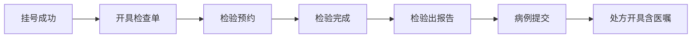

# 多病种通用就诊流程宣教接口文档

## 文档信息

| 项目 | 内容 |
| --- | --- |
| 文档版本 | v1.0 |
| 更新日期 | 2026-03-17 |
| 对接方式 | HTTPs API（JSON） |

## 对接前置说明

### 环境信息

| 项目 | 测试环境                     | 生产环境       |
| --- |--------------------------|------------|
| Base URL | https://api.aiqikang.com | 待医院提供      |
| 网络策略 | 公网部署                     | 内网部署、白名单互通 |
| 字符集 | UTF-8                    | UTF-8      |


## 1. 文档目的与适用范围

适用业务范围：
- 门诊与住院就诊流程
- 检查/检验相关申请、预约、执行、报告
- 病历提交与处方开具（含长期/临时医嘱）
- 患者教育与随访消息触发

## 2. 鉴权方式（联调约定）
- 网关签名鉴权（`X-Access-Key` + `X-Signature`）

## 3. 通用标识与字段规范

### 3.1 统一主索引

所有接口建议优先复用以下通用字段。

| 字段名 | 中文说明 | 示例值 | 是否必填 |
| --- | --- | --- | --- |
| patientId | 患者唯一标识（建议 HIS 主索引） | P123456 | 是 |
| visitId | 就诊唯一标识（门诊/住院） | V20260317001 | 是 |
| encounterType | 就诊类型（门诊/住院/急诊） | OUTPATIENT | 是 |
| registrationNo | 挂号号 | REG202603170001 | 条件必填（挂号场景） |
| applyNo | 检查/检验申请单号 | AP202603170015 | 条件必填（申请场景） |
| reservationNo | 预约单号 | RSV202603170009 | 条件必填（预约场景） |
| reportNo | 报告单号 | RPT202603170031 | 条件必填（报告场景） |
| caseNo | 病历号/病例号 | EMR202603170066 | 条件必填（病历场景） |
| prescriptionNo | 处方号 | RX202603170088 | 条件必填（处方场景） |
| orderNo | 医嘱号 | ORD202603170099 | 条件必填（医嘱场景） |

### 3.1.1 跨院区部署必填字段（所有接口强制）

为避免多院区串单，以下字段所有事件必须携带：

| 字段名 | 中文说明 | 示例值                 | 是否必填         |
| --- | --- |------|---------|
| hospitalId | 医院主键（平台侧机构ID） | HOSP1001            | 是（平台对接）      |
| orgCode | 医疗机构编码（院级） | XXRMYY              | 是            |
| campusCode | 院区编码 | BJYQ                | 否（单院区可空，跨院区必填） |
| sourceSystem | 事件来源系统 | HIS                 | 是            |
| sourceSystemInstance | 来源系统实例标识（多活/多机房） | his-prod-a          | 否            |
| eventType | 事件类型 | lab.report.published | 否            |
| eventTime | 事件发生时间 | 2026-03-18T10:20:00+08:00 | 是            |
| traceId | 链路追踪号 | 9d1c7dbe2f5e4b4e    | 是            |

唯一性建议：
- 业务主键建议按 `hospitalId + orgCode + campusCode + visitId` 组合约束。
- 单据主键建议按 `hospitalId + orgCode + campusCode + applyNo/reportNo/prescriptionNo` 组合约束。

### 3.2 时间与字典规范

- 时间统一使用 ISO-8601：`yyyy-MM-dd'T'HH:mm:ssXXX`
- 医疗术语编码：
  - 诊断：ICD-10（院内可有扩展码）
  - 手术/操作：ICD-9-CM3 或院内操作编码
  - 检验项目：LIS 项目编码
  - 药品：国家药品编码/院内药品编码
- 字典值应提供值域和中文说明，严禁自由文本替代枚举

### 3.3 安全与合规

- 传输：HTTPS + 签名验签（推荐 HMAC-SHA256）
- 隐私：手机号、身份证号、住址等敏感字段脱敏展示

### 3.4 对外接口鉴权规范（生产建议）

#### 3.4.1 请求头规范

| 请求头 | 中文说明 | 示例值           | 是否必填 |
| --- | --- |---------------| --- |
| X-Access-Key | 调用方标识 | xg-his-prod   | 是 |
| X-Timestamp | 请求时间戳（毫秒） | 1773715200000 | 是 |
| X-Nonce | 单次随机串 | 4d9f1b7e9c11  | 是 |
| X-Signature | 签名摘要（HMAC-SHA256） | 8b7d...e21a   | 是 |
| X-Sign-Version | 签名版本 | v1            | 是 |

#### 3.4.2 签名串与校验规则

- 签名算法：`HMAC-SHA256`
- 建议签名串：`HTTP_METHOD + "\n" + PATH + "\n" + X-Timestamp + "\n" + X-Nonce + "\n" + BODY_SHA256`
- 服务端校验顺序：
  1. 校验时间窗（建议 ±300 秒）
  2. 校验 nonce 防重放（Redis 保留 5-10 分钟）
  3. 校验签名
- 失败响应统一返回第 6 节错误码

## 4. 全流程时序（多病种通用）



说明：
- 该主线覆盖“诊前-诊中-诊后”关键节点。
- 不同病种可在节点间扩展子流程（如内镜签署同意书、糖尿病随访打卡），但主键与状态语义保持一致。

## 5. 核心接口清单（至少 7 个）

以下接口为平台最小可用集合，建议按事件推送 + 查询兜底方式建设。

推荐统一事件入口（标准模式）：
- `POST /api/v1/events/registration-success`
- `POST /api/v1/events/exam-order-issued`
- `POST /api/v1/events/lab-reservation`
- `POST /api/v1/events/lab-completed`
- `POST /api/v1/events/lab-report-published`
- `POST /api/v1/events/case-submitted`
- `POST /api/v1/events/prescription-issued`

### 5.1 挂号成功接口

- 事件名：`registration.success`
- 触发时机：患者完成挂号并生成有效就诊记录
- 业务用途：触发初始宣教、就诊提醒、流程追踪

请求字段（核心）：

| 字段名 | 中文说明 | 示例值 | 是否必填 |
| --- | --- | --- | --- |
| eventId | 事件唯一标识（幂等键） | evt-reg-20260317-0001 | 是 |
| patientId | 患者唯一标识 | P123456 | 是 |
| visitId | 就诊唯一标识 | V20260317001 | 是 |
| encounterType | 就诊类型 | OUTPATIENT | 是 |
| registrationNo | 挂号号 | REG202603170001 | 是 |
| departmentCode | 挂号科室编码 | DIG001 | 是 |
| departmentName | 挂号科室名称 | 消化内科 | 是 |
| doctorId | 医生工号/编码 | D00982 | 是 |
| doctorName | 医生姓名 | 张晓 | 是 |
| scheduledTime | 预约就诊时间 | 2026-03-17T09:30:00+08:00 | 是 |

状态要求：
- 成功后不可重复创建就诊主线；重复事件按 `eventId` 去重

### 5.2 开具检查单接口

- 事件名：`exam.order.issued`
- 触发时机：医生下达检查申请（如胃镜、肠镜、影像）
- 业务用途：触发检查前准备教育、路线指引、注意事项

请求字段（核心）：

| 字段名 | 中文说明 | 示例值 | 是否必填 |
| --- | --- | --- | --- |
| eventId | 事件唯一标识 | evt-exam-20260317-0001 | 是 |
| patientId | 患者唯一标识 | P123456 | 是 |
| visitId | 就诊唯一标识 | V20260317001 | 是 |
| applyNo | 检查申请单号 | AP202603170015 | 是 |
| examItems | 检查项目列表（含编码、名称、部位） | [{\"itemCode\":\"EXM001\",\"itemName\":\"胃镜\",\"bodyPart\":\"胃\"}] | 是 |
| applyDepartment | 申请科室（编码/名称） | DIG001/消化内科 | 是 |
| applyDoctor | 申请医生（工号/姓名） | D00982/张晓 | 是 |
| clinicalDiagnosis | 临床诊断列表（ICD-10） | [{\"code\":\"K29.5\",\"name\":\"慢性胃炎\"}] | 是 |
| priority | 紧急程度 | NORMAL | 是 |
| status | 申请状态 | ISSUED | 是 |
| cancelReason | 取消原因 | 患者改期 | 否（取消时必填） |

状态要求：
- `ISSUED -> CANCELLED` 可逆，取消需携带 `cancelReason`

### 5.3 检验预约接口

- 事件名：`lab.reservation.created`
- 触发时机：检验预约成功（如 C13/C14、生化、免疫等）
- 业务用途：触发预约确认、禁食/停药等宣教、到诊提醒

请求字段（核心）：

| 字段名 | 中文说明 | 示例值 | 是否必填 |
| --- | --- | --- | --- |
| eventId | 事件唯一标识 | evt-lab-res-20260317-0001 | 是 |
| patientId | 患者唯一标识 | P123456 | 是 |
| visitId | 就诊唯一标识 | V20260317001 | 是 |
| applyNo | 检验申请单号 | AP202603170115 | 是 |
| reservationNo | 检验预约单号 | RSV202603170009 | 是 |
| labItems | 检验项目列表（含编码、名称） | [{\"itemCode\":\"LAB_C13\",\"itemName\":\"13C呼气试验\"}] | 是 |
| reservationTime | 预约执行时间 | 2026-03-18T08:00:00+08:00 | 是 |
| executeDepartment | 执行科室（编码/名称） | END001/内镜中心 | 是 |
| preparationInstructions | 检验前准备说明 | [{\"type\":\"FASTING\",\"desc\":\"空腹8小时\"}] | 否 |
| status | 预约状态 | SUCCESS | 是 |

状态要求：
- 改约使用新事件推送，保留原 `reservationNo` 与变更记录

### 5.4 检验完成接口

- 事件名：`lab.completed`
- 触发时机：检验执行结束，待审核/待报告
- 业务用途：通知患者“已完成采样/检测”，进入报告等待阶段

请求字段（核心）：

| 字段名 | 中文说明 | 示例值 | 是否必填 |
| --- | --- | --- | --- |
| eventId | 事件唯一标识 | evt-lab-done-20260317-0001 | 是 |
| patientId | 患者唯一标识 | P123456 | 是 |
| visitId | 就诊唯一标识 | V20260317001 | 是 |
| applyNo | 检验申请单号 | AP202603170115 | 是 |
| reservationNo | 预约单号 | RSV202603170009 | 是 |
| completedTime | 检验完成时间 | 2026-03-18T08:40:00+08:00 | 是 |
| sampleInfo | 样本信息（类型、采样时间） | {\"sampleType\":\"呼气样本\",\"sampleTime\":\"2026-03-18T08:10:00+08:00\"} | 否 |
| status | 检验状态 | COMPLETED | 是 |

状态要求：
- 仅在执行完成后触发，禁止在预约阶段提前推送

### 5.5 检验出报告接口

- 事件名：`lab.report.published`
- 触发时机：报告审核通过并发布
- 业务用途：触发结果解读、异常告警、复诊/复查建议

请求字段（核心）：

| 字段名 | 中文说明 | 示例值 | 是否必填 |
| --- | --- | --- | --- |
| eventId | 事件唯一标识 | evt-lab-report-20260317-0001 | 是 |
| patientId | 患者唯一标识 | P123456 | 是 |
| visitId | 就诊唯一标识 | V20260317001 | 是 |
| applyNo | 检验申请单号 | AP202603170115 | 是 |
| reportNo | 报告单号 | RPT202603170031 | 是 |
| reportTime | 报告发布时间 | 2026-03-18T10:20:00+08:00 | 是 |
| results | 结果明细（编码、名称、结果值、单位、参考区间、异常标记） | [{\"code\":\"DOB\",\"name\":\"DOB值\",\"value\":\"4.0\",\"unit\":\"\",\"ref\":\"<4.0\",\"abnormalFlag\":\"H\"}] | 是 |
| conclusion | 报告结论 | 13C呼气试验阳性 | 是 |
| auditor | 审核人 | 王医生 | 是 |
| reportDoctor | 报告医生 | 李医生 | 是 |
| reportUrl | 报告链接（院内） | https://his.example.com/report/RPT202603170031 | 否 |
| isRevision | 是否更正报告 | false | 否 |
| revisionNo | 更正版本号 | REV2 | 否（更正时必填） |

`results` 子结构建议（用于标准化 LIS 对接）：

| 子字段名 | 中文说明 | 示例值 | 是否必填 |
| --- | --- | --- | --- |
| code | 指标编码 | DOB | 是 |
| name | 指标名称 | DOB值 | 是 |
| resultType | 结果类型（NUMERIC/TEXT） | NUMERIC | 是 |
| value | 结果值 | 4.0 | 是 |
| unit | 单位 | （空） | 否 |
| low | 参考下限 | 0 | 否 |
| high | 参考上限 | 4.0 | 否 |
| ref | 参考区间文本 | <4.0 | 否 |
| abnormalFlag | 异常标记（L/N/H） | H | 否 |
| criticalFlag | 危急值标记 | false | 否 |
| specimenType | 标本类型 | 呼气样本 | 否 |
| specimenCollectedTime | 采样时间 | 2026-03-18T08:10:00+08:00 | 否 |
| verifiedTime | 审核时间 | 2026-03-18T10:15:00+08:00 | 否 |

状态要求：
- 报告更正需推送 `isRevision=true` 与 `revisionNo`

### 5.6 病例提交接口

- 事件名：`case.submitted`
- 触发时机：医生完成并提交病历（门诊病历/出院记录）
- 业务用途：作为诊疗阶段闭环与后续个体化宣教触发条件

请求字段（核心）：

| 字段名 | 中文说明 | 示例值 | 是否必填 |
| --- | --- | --- | --- |
| eventId | 事件唯一标识 | evt-case-20260317-0001 | 是 |
| patientId | 患者唯一标识 | P123456 | 是 |
| visitId | 就诊唯一标识 | V20260317001 | 是 |
| caseNo | 病历号/病例号 | EMR202603170066 | 是 |
| chiefComplaint | 主诉 | 上腹痛2周 | 是 |
| historyOfPresentIllness | 现病史 | 近2周反复上腹隐痛，餐后加重 | 是 |
| diagnosis | 诊断列表（名称+ICD-10） | [{\"code\":\"K29.5\",\"name\":\"慢性胃炎\"}] | 是 |
| caseSubmitTime | 病历提交时间 | 2026-03-18T11:00:00+08:00 | 是 |
| authorDoctor | 病历提交医生 | 张晓 | 是 |
| caseVersion | 病历版本号 | 1 | 否 |

状态要求：
- 病历补录/修订需保留版本号 `caseVersion`

### 5.7 处方开具接口（含医嘱）

- 事件名：`prescription.issued`
- 触发时机：处方审核通过并生效，或医嘱开立完成
- 业务用途：触发用药教育、服药日历、复查提醒、依从性管理

请求字段（核心）：

| 字段名 | 中文说明 | 示例值 | 是否必填 |
| --- | --- | --- | --- |
| eventId | 事件唯一标识 | evt-rx-20260317-0001 | 是 |
| patientId | 患者唯一标识 | P123456 | 是 |
| visitId | 就诊唯一标识 | V20260317001 | 是 |
| prescriptionNo | 处方号 | RX202603170088 | 是 |
| diagnosis | 诊断列表（名称+ICD-10） | [{\"code\":\"A04.8\",\"name\":\"幽门螺杆菌感染\"}] | 是 |
| prescriptionTime | 处方开具时间 | 2026-03-18T11:20:00+08:00 | 是 |
| prescriptionDoctor | 处方医生 | 张晓 | 是 |
| reviewPharmacist | 审核药师 | 周药师 | 否 |
| medications | 药品列表（编码、名称、剂量、频次、途径、疗程、用法） | [{\"drugCode\":\"D001\",\"drugName\":\"埃索美拉唑\",\"dosage\":\"20mg\",\"frequency\":\"BID\",\"route\":\"PO\",\"durationDays\":14,\"usageInstruction\":\"饭前30分钟服用\"}] | 是 |
| orders | 医嘱列表（医嘱号、类型、内容、执行科室、起止时间） | [{\"orderNo\":\"ORD202603170099\",\"orderType\":\"LONG\",\"orderContent\":\"清淡饮食\",\"executeDept\":\"消化内科\",\"startTime\":\"2026-03-18T11:20:00+08:00\",\"endTime\":\"2026-04-01T11:20:00+08:00\"}] | 否 |

`medications` 子结构建议（用于处方落库/审方/执行）：

| 子字段名 | 中文说明 | 示例值 | 是否必填 |
| --- | --- | --- | --- |
| drugCode | 药品编码 | D001 | 是 |
| drugName | 药品名称 | 埃索美拉唑 | 是 |
| dosage | 单次剂量 | 20 | 是 |
| dosageUnit | 剂量单位 | mg | 是 |
| frequencyCode | 频次编码 | BID | 是 |
| frequencyText | 频次中文说明 | 每日2次 | 是 |
| routeCode | 给药途径编码 | PO | 是 |
| routeText | 给药途径中文说明 | 口服 | 是 |
| durationDays | 疗程天数 | 14 | 是 |
| totalQuantity | 总量 | 28 | 否 |
| usageInstruction | 用法说明 | 饭前30分钟服用 | 否 |
| firstDoseTime | 首剂时间 | 2026-03-18T12:00:00+08:00 | 否 |

`orders` 子结构建议（用于医嘱执行闭环）：

| 子字段名 | 中文说明 | 示例值 | 是否必填 |
| --- | --- | --- | --- |
| orderNo | 医嘱号 | ORD202603170099 | 是 |
| orderType | 医嘱类型（LONG/TEMP） | LONG | 是 |
| orderStatus | 医嘱状态（ACTIVE/STOPPED/CANCELLED） | ACTIVE | 是 |
| orderContent | 医嘱内容 | 清淡饮食 | 是 |
| executeDept | 执行科室 | 消化内科 | 是 |
| startTime | 生效时间 | 2026-03-18T11:20:00+08:00 | 是 |
| endTime | 结束时间 | 2026-04-01T11:20:00+08:00 | 否 |
| stopReason | 停嘱原因 | 疗程结束 | 否（停嘱时必填） |

状态要求：
- 撤方、停嘱、换药必须推送增量事件并引用原单号

## 6. 统一响应与错误码规范

响应结构建议：

```json
{
  "code": "0",
  "message": "success",
  "traceId": "f2b8f0be-xxxx-xxxx-xxxx-xxxxxxxxxxxx",
  "data": {
    "accepted": true,
    "eventId": "evt-20260317-0001"
  }
}
```

错误码：
- `0`：成功
- `1001`：签名校验失败
- `1002`：时间戳过期
- `1003`：Nonce 重放
- `1004`：AccessKey 无效
- `2001`：必填字段缺失
- `2002`：字段字典值非法
- `3001`：业务主键不存在（如 `visitId`）
- `3002`：状态流转非法
- `9001`：系统异常（可重试）

## 7. 通知消息推送接口（需对接方提供） 
